<p align="center">
  
</p>
<div align="center">

# 

</div>

# 👾 whoami

```python
class SecurityProfile:

    name = "Sachin Viknesh M.K"

    role = [
        "Cyber Security Student",
        "Java Developer",
        "CTF Player",
        "Security Research Enthusiast"
    ]

    college = "R.M.K College of Engineering and Technology"

    degree = "B.E Computer Science Engineering (Cyber Security)"

    batch = "2024 - 2028"

    current_year = "3rd Year"

    cgpa = "7.08"

    location = "Chennai, India"

    interests = [
        "Ethical Hacking",
        "Penetration Testing",
        "Web Security",
        "Cryptography",
        "Digital Forensics",
        "Malware Analysis",
        "Reverse Engineering",
        "Secure Coding"
    ]

    certifications = [
        "Oracle Java Foundations",
        "Cyber Security Foundation",
        "MongoDB",
        "AWS",
        "Infosys Springboard",
        "Innovation Ambassador",
        "LinkedIn Learning",
        "Great Learning"
    ]

    achievements = [
        "🏆 1st Place - Capture The Flag",
        "🎓 Research Paper Presenter",
        "💻 Cyber Security Intern",
        "📜 50+ Technical Certificates",
        "🔐 Ethical Hacking Learner"
    ]

    currently_learning = [
        "Advanced Web Penetration Testing",
        "Red Teaming",
        "Active Directory",
        "Cloud Security",
        "Digital Forensics"
    ]
```

---

# ⚡ Current Status

```text
███████████████████████████

Name        : Sachin Viknesh M.K

Status      : Online 🟢

Role        : Cyber Security Student

Focus       : Ethical Hacking

CTF         : Active

Research    : AI Security

Learning    : Penetration Testing

Projects    : TrueShield AI

███████████████████████████
```

---

<div align="center">

| 🏆 Achievement | Value |
|---------------|------:|
| 🎖️ CTF Rank | 1st Place |
| 📜 Certificates | 50+ |
| 💻 Internship | Cyber Security |
| 📄 Research Papers | 1 |
| 🎓 Current Degree | B.E CSE (Cyber Security) |

</div>

---

# 🏆 CTF & Competition War Room

> **Capture The Flag | Hackathons | Cyber Security Competitions**

<table align="center">
<tr>
<th>🏅 Rank</th>
<th>Competition</th>
<th>Achievement</th>
<th>Year</th>
</tr>

<tr>
<td>🥇 1st</td>
<td>Capture The Flag (CTF)</td>
<td>HOCKMIND Team (950 Individual Points)</td>
<td>2025</td>
</tr>

<tr>
<td>📄 Presenter</td>
<td>International Conference (ICDAIC'26)</td>
<td>AI-Assisted Maritime Surveillance Research Paper</td>
<td>2026</td>
</tr>

</table>

---

# ⚔️ Tech Arsenal

<div align="center">

## 💻 Programming Languages


---

## 🌐 Frontend


---

## ⚙ Backend


---

## 🗄 Database


---

## 🛡 Cyber Security


---

## ☁ Cloud


---

## ⚡ Tools


</div>

---

# 📚 Currently Learning

```text
██████████████████████████████████████

✓ Active Directory

✓ Web Penetration Testing

✓ API Security

✓ Reverse Engineering

✓ Malware Analysis

✓ Windows Privilege Escalation

✓ Linux Privilege Escalation

✓ Active CTF Challenges

██████████████████████████████████████
```

---

# 🎯 Skill Matrix

| Domain | Level |
|---------|-------|
| Java | ⭐⭐⭐⭐⭐ |
| Python | ⭐⭐⭐⭐☆ |
| SQL | ⭐⭐⭐⭐☆ |
| Networking | ⭐⭐⭐⭐☆ |
| Linux | ⭐⭐⭐⭐☆ |
| Ethical Hacking | ⭐⭐⭐⭐☆ |
| Web Security | ⭐⭐⭐⭐☆ |
| Cryptography | ⭐⭐⭐⭐☆ |
| Digital Forensics | ⭐⭐⭐☆☆ |
| ReactJS | ⭐⭐⭐☆☆ |
| NodeJS | ⭐⭐⭐☆☆ |
| MongoDB | ⭐⭐⭐☆☆ |

---

# 🧠 Cyber Security Interests

```text
✔ Penetration Testing

✔ Vulnerability Assessment

✔ Web Security

✔ Digital Forensics

✔ Cryptography

✔ Reverse Engineering

✔ Incident Response

✔ AI in Cyber Security

✔ Malware Analysis

✔ Secure Coding
```

---

<div align="center">

## ⚡ "Hack to Learn. Learn to Secure."

</div>

---

# 🚀 Featured Projects

<table>
<tr>

<td width="50%">

## 🛡 TrueShield AI

AI-powered Cyber Security Surveillance System

### Features

- 🎯 Real-Time Threat Detection
- 📹 Live Camera Monitoring
- 📧 Email Alert System
- 🤖 AI Fight Detection
- 📊 Security Dashboard
- 🔔 Instant Notifications

### Tech Stack

`React`

`Node.js`

`Express`

`SQLite`

`Socket.IO`

`Prisma`

🔗 **Repository:** *(Coming Soon)*

</td>

<td width="50%">

## 🔐 Password Security Checker

Password strength analyzer capable of checking

- Weak Passwords

- Password Entropy

- Common Password Detection

- Secure Password Suggestions

### Technologies

`Java`

`Python`

`Regex`

🔗 **Repository:** *(Coming Soon)*

</td>

</tr>

<tr>

<td>

## 🌐 Vulnerability Scanner

Basic Web Vulnerability Scanner

Features

- Port Scanning

- Banner Grabbing

- HTTP Header Analysis

- Website Fingerprinting

Tools

`Python`

`Nmap`

`Requests`

</td>

<td>

## 🕵 Digital Forensics Learning

Hands-on practice with

- Memory Analysis

- Disk Investigation

- Log Analysis

- Malware Investigation

Tools

`Autopsy`

`Wireshark`

`Volatility`

</td>

</tr>

</table>

---

# 💼 Experience Timeline

```text
2026
│
├── 💻 Cyber Security Intern
│      Thiranex
│
├── 🎓 Research Paper Presentation
│      Velammal Institute of Technology
│
├── 🏆 Capture The Flag Winner
│      HOCKMIND Team
│
├── 🏅 Innovation Ambassador
│      Foundation Level
│
├── 🏅 Innovation Ambassador
│      Advanced Level
│
├── 🏅 Innovation Ambassador
│      Reskilling Program
│
└── 🚀 Learning Full Stack & Penetration Testing
```

---

# 📄 Research Paper

### AI-Assisted Maritime Surveillance and Automated Threat Detection

Presented at

**3rd International Conference on Data Analytics and Intelligence Computing (ICDAIC'26)**

🏫 Velammal Institute of Technology

📅 April 2026

---

# 💼 Internship

## Cyber Security Intern

🏢 Thiranex

Duration

```
11 June 2026

↓

10 July 2026
```

### Skills Learned

- Vulnerability Assessment

- Penetration Testing

- Security Auditing

- Linux Administration

- Networking

---

# 📜 Major Certifications

| Provider | Certification |
|-----------|---------------|
| Oracle | Java Foundations |
| Cisco | Introduction to Cyber Security |
| HP LIFE | Cyber Security Awareness |
| Infosys Springboard | Cyber Security Foundation |
| Infosys Springboard | Ethical Hacking for Beginners |
| Infosys Springboard | Information Security |
| Infosys Springboard | Cryptography |
| MongoDB | AI Data Strategy |
| MongoDB | MongoDB Basics |
| AWS | AWS For Beginners |
| LinkedIn Learning | LinkedIn Hiring Assistant |
| Great Learning | AWS Course |
| Hack & Fix | Certified Online Fraud Prevention Specialist |
| Cappriciosec | CEH & Penetration Testing |
| Cappriciosec | WiFi Pentesting |
| TCM Security | Linux Fundamentals |
| Udemy | Network Mastery for Ethical Hackers |
| OneRoadmap | Java |
| OneRoadmap | Python |
| OneRoadmap | SQL |
| Innovation Ambassador | Foundation |
| Innovation Ambassador | Advanced |
| Innovation Ambassador | Reskilling |

---

# 🎓 College Coursework

✔ Advanced Java

✔ Database Management Systems

✔ Web Development Frameworks

✔ Windows & Linux Internals

✔ Product Development

✔ Number Theory & Cryptography

✔ Design & Analysis of Algorithms

---

# 📈 Current Learning Roadmap

```text
██████████████████████████████

✓ Active Directory

✓ Windows Exploitation

✓ Linux Privilege Escalation

✓ Burp Suite Professional

✓ API Security

✓ Malware Analysis

✓ Reverse Engineering

✓ Cloud Security

✓ Red Teaming

██████████████████████████████
```

---
<div align="center">

# 🎯 2026 Mission Roadmap

<table align="center">
<tr>
<td>

🛡️ **Cyber Security Projects**  
🟩🟩🟩🟩⬜ 80%

</td>
<td>

🏆 **Participate in National CTFs**  
🟩🟩🟩⬜⬜ 60%

</td>
</tr>

<tr>
<td>

📑 **Publish Research Papers**  
🟩🟩⬜⬜⬜ 40%

</td>
<td>

⚔️ **Master Penetration Testing**  
🟩🟩🟩🟩⬜ 80%

</td>
</tr>

<tr>
<td>

🌍 **Contribute to Open Source**  
🟩🟩🟩⬜⬜ 60%

</td>
<td>

🚀 **Strengthen GitHub Portfolio**  
🟩🟩🟩🟩🟩 100%

</td>
</tr>
</table>
</div>

# 📊 GitHub Analytics

<div align="center">


</div>

---

# 📈 Contribution Graph

<div align="center">


</div>

---

# 🐍 Contribution Snake

<div align="center">

<picture>

<source media="(prefers-color-scheme: dark)"
srcset="https://raw.githubusercontent.com/sachinviknesh/sachinviknesh/output/github-snake-dark.svg"/>

<source media="(prefers-color-scheme: light)"
srcset="https://raw.githubusercontent.com/sachinviknesh/sachinviknesh/output/github-snake.svg"/>


</picture>

</div>

---

# 🎖 Certifications Snapshot

<div align="center">

| 📜 Total | 🏆 Major Domains |
|----------|------------------|
| 50+ | Cyber Security |
| Oracle Java | Java |
| Cisco | Networking |
| MongoDB | Database |
| AWS | Cloud |
| Infosys | AI & Security |
| NPTEL | Privacy |
| TCM Security | Linux |
| Cappriciosec | Ethical Hacking |

</div>

---

# 🌍 Connect With Me

<div align="center">

<a href="https://www.linkedin.com/in/sachin-viknesh-m-k-417862311/">


</a>

<a href="https://github.com/sachinviknesh">


</a>

<a href="mailto:sachinviknesh6002@gmail.com">


</a>

</div>

---

<div align="center">

## 💬 Favorite Quote

> **"Security is not a product, but a process."**

🛡 Keep Learning • Keep Building • Keep Securing


</div>
